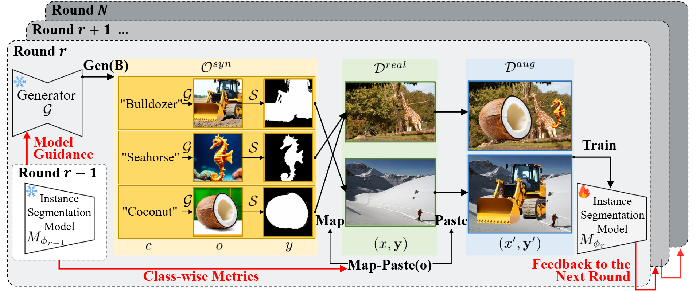

# Sample-Efficient Multi-Round Generative Data Augmentation for Long-Tail Instance Segmentation



## Description

Data synthesis has become increasingly crucial for long-tail instance segmentation tasks to mitigate class imbalance and high annotation costs. We propose a **collaborative** approach that incorporates feedback from an instance segmentation model to guide the augmentation process. Specifically, the diffusion model uses feedback to generate objects that exhibit high uncertainty. The number and size of synthesized objects for each class are dynamically adjusted based on the model state to improve learning in underrepresented classes. This augmentation process is further strengthened by running **multiple rounds**, allowing feedback to be refined throughout training. In summary, **multi-round collaborative augmentation,(MRCA)** enhances sample efficiency by providing optimal synthetic data at the right moment. 

## Getting Started 


1. Generate images with stablediffusion3:
Set your access_token from [StableDiffusion3](https://huggingface.co/stabilityai/stable-diffusion-3-medium) to use the model.
```
cd generator

python generate.py
```

2. Segment foreground objects:
```
cd diSegmenter

python segmentAndFilter.py
```


3. Train instance segmentation model:
```
bash launch.sh --config configs/ODOD/ODOD_R50_sd3.yaml 
```

3. Test with given checkpoint:
```
bash launch.sh --config configs/ODOD/ODOD_R50_sd3.yaml --eval-only
```

## References & Acknowledgements
We use code from
[Detectron2](https://github.com/facebookresearch/detectron2),
[StableDiffusion3](https://huggingface.co/stabilityai/stable-diffusion-3-medium),
[CenterNet2](https://github.com/xingyizhou/CenterNet2),
[X-Paste](https://github.com/yoctta/XPaste), and
[BSGAL](https://github.com/aim-uofa/DiverGen/tree/main/BSGAL)


